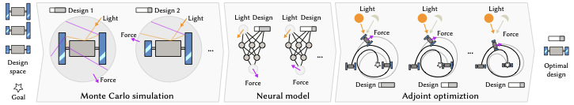

<p align="center">

  <h1 align="center"><a href="https://arxiv.org/abs/2602.10712">Photons &times; Force: Differentiable Radiation Pressure Modeling</a></h1>

  <div align="center">
    <a href="https://arxiv.org/abs/2602.10712">
      
    </a>
  </div>

  <p align="center">
    <i>ACM Transactions on Graphics (SIGGRAPH 2026)</i>
    <br />
    <a href="https://github.com/CharlesPlusC"><strong>Charles Constant</strong></a>
    &middot;
    <strong>Elizabeth Bates</strong>
    &middot;
    <strong>Santosh Bhattarai</strong>
    &middot;
    <strong>Marek Ziebart</strong>
    &middot;
    <a href="https://www.homepages.ucl.ac.uk/~ucactri/"><strong>Tobias Ritschel</strong></a>
  </p>
</p>

## About

This repository contains the official implementation of the paper "Photons &times; Force: Differentiable Radiation Pressure Modeling", which proposes a system for optimizing parametric spacecraft designs subject to solar radiation pressure. The implementation is in JAX and has three stages:

1. **Monte Carlo simulation** of radiation pressure forces and torques for parameterized spacecraft geometries
2. **Neural proxy** that learns the mapping from sun direction and design parameters to force/torque, enabling fast, noise-free, differentiable queries
3. **Adjoint optimization** through an ODE integrator to recover design parameters that achieve a desired trajectory

The following modules may be of primary interest:
* `raytracing.py`, `estimation.py`, `srp_simulation.py`: Monte Carlo ray tracing and force/torque map generation
* `designer.py`: parametric spacecraft geometry (panel rotation, louver blinds, face albedo, box-wing scaling)
* `nn.py`: neural proxy training and inference
* `force_modeling.py`, `integrator.py`: ODE formulation and RK4 integration
* `physics.py`: gravity models (EGM2008), eclipse, attitude, third-body perturbations

## Getting Started

Setup the environment and install the required packages using conda

```bash
conda create -n photonsxforce python=3.10
conda activate photonsxforce
```

Install the package by running the following command in the repository directory

```bash
pip install -e .
```

For GPU acceleration:

```bash
pip install -e ".[gpu]"
```

Now you can explore and run the notebooks provided in `experiments/`.

### Forward Simulation

The Monte Carlo SRP simulation computes forces and torques for a given spacecraft mesh under varying sun directions and design parameters. For a **static spacecraft** (no design parameters):

```python
import raytracing, srp_simulation, estimation, designer

mesh = raytracing.load_mesh('data/3d/gps2f/gps2f.obj')
design = designer.Design(lambda v, f, p: v, lambda m, p: m, 0)
designer.my_design = design

force, torque, directions, parameters = srp_simulation.build_force_map(
    (90, 180),    # sun direction grid (lat, lon)
    1000,         # MC samples per direction
    estimation.estimate_backward,
    mesh,
    design,
)
```

For a **parametric design** (e.g. a cuboid with per-face albedo):

```python
face_specs = [designer.make_face_albedo_spec(f'Face_{i+1}') for i in range(6)]
albedo_design = designer.build_face_albedo_design('cuboid_6faces/cuboid_6faces', face_specs)
designer.my_design = albedo_design

force, torque, directions, parameters = srp_simulation.build_force_map(
    (90, 180), 1000, estimation.estimate_backward, mesh, albedo_design)
```

The output arrays contain force/torque vectors for each (sun direction, design parameter) pair and can be saved as `.npy` files for neural proxy training.

### Neural Proxy Training

Train a neural proxy from precomputed force/torque maps:

```python
import nn

nn.train_combined_proxy(
    'cuboid_6faces/cuboid_6faces',
    'face_albedo_sweep',
    (90, 180),
    load_pretrained=False,
    num_hidden_layers=5,
    hidden_width=192,
    max_steps=100_000,
)
```

The trained proxy can then query forces orders of magnitude faster than the MC simulation and is fully differentiable.

### Adjoint Optimization

The notebooks in `experiments/` demonstrate optimizing spacecraft designs by differentiating through the ODE solver. The general pattern is:

1. Load a trained neural proxy
2. Define a loss on the final (or intermediate) trajectory state
3. Use `jax.value_and_grad` with the proxy inside the integration loop
4. Optimize with `optax`

See `experiments/InverseConstant.ipynb` for a minimal example recovering a known simulation parameter, or `experiments/InverseDiscoBoxDownSampled.ipynb` for the full collision avoidance application.

### Experiments

Each notebook in `experiments/` reproduces results from a section of the paper:

| Notebook | Section | Description |
|----------|---------|-------------|
| `GPS2F_benchmark.ipynb` | 4.2 | SRP method comparison on GPS satellites |
| `ProxyConvergenceTiming.ipynb` | 4.3 | Neural proxy convergence timing |
| `InverseConstant.ipynb` | 4.4 | Adjoint parameter recovery |
| `InversePointReflectance.ipynb` | 5.1 | Way-point intercept |
| `InverseRot3PanlDownsd.ipynb` | 5.2 | Attitude control |
| `InverseDiscoBoxDownSampled.ipynb` | 5.4 | Collision avoidance |
| `hp_density_table_inversion.py` | 5.5 | Atmospheric density recovery |
| `InverseLamellae.ipynb` | 5.6 | Formation flight |
| `InverseBoxWingFamily.ipynb` | 5.7 | Shape-from-pressure |
| `PolicyCollisionAvoidance.ipynb` | 5.8 | Neural control policy |
| `InverseGPUCAM.ipynb` | 5.9 | Compute-in-space |

## License

The accompanying paper is published under CC BY 4.0. The code in this repository is released under the PolyForm Noncommercial License 1.0.0; see LICENSE. Non-commercial use (research, teaching, personal projects, evaluation) is permitted; for commercial use, contact the authors.

## Citation

```bibtex
@article{constant2026photonsxforce,
    author    = {Constant, Charles and Bates, Elizabeth and Bhattarai, Santosh and Ziebart, Marek and Ritschel, Tobias},
    title     = {Photons$\,\times\,$Force: Differentiable Radiation Pressure Modeling},
    journal   = {ACM Transactions on Graphics},
    volume    = {45},
    number    = {4},
    articleno = {82},
    month     = {7},
    year      = {2026},
    publisher = {Association for Computing Machinery},
    address   = {New York, NY, USA},
    doi       = {10.1145/3811396},
    url       = {https://doi.org/10.1145/3811396}
}
```
